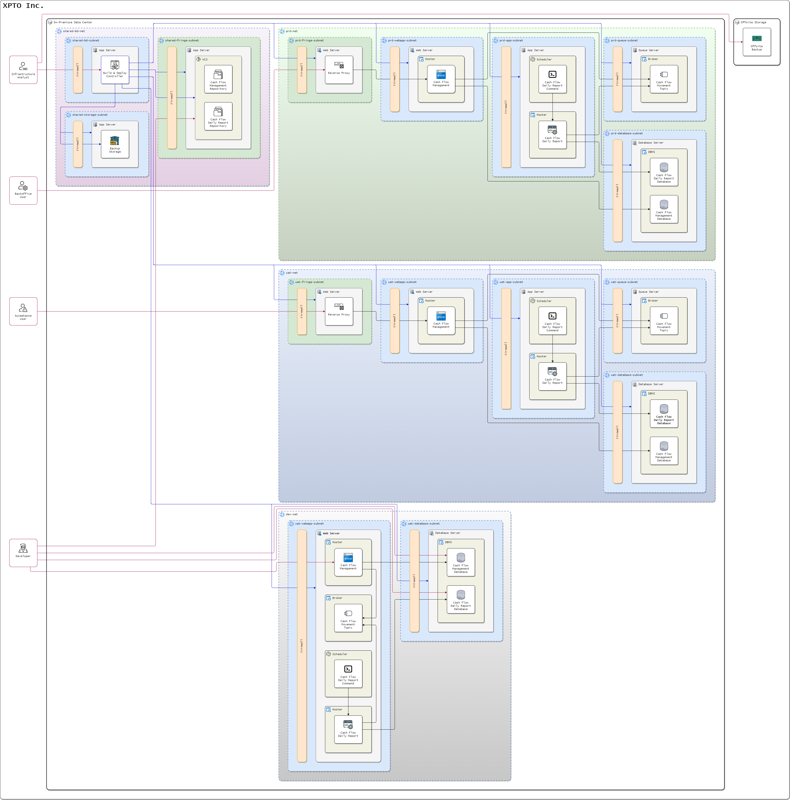
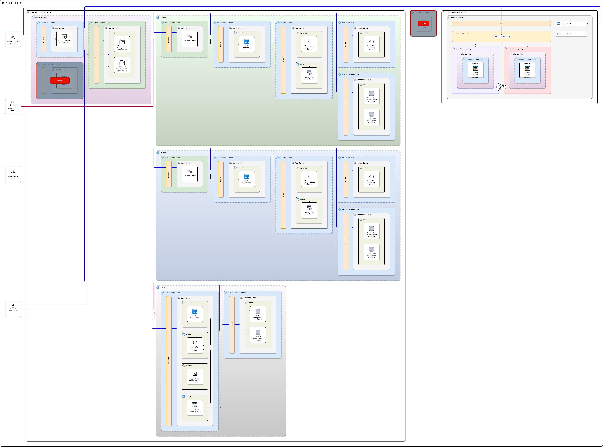
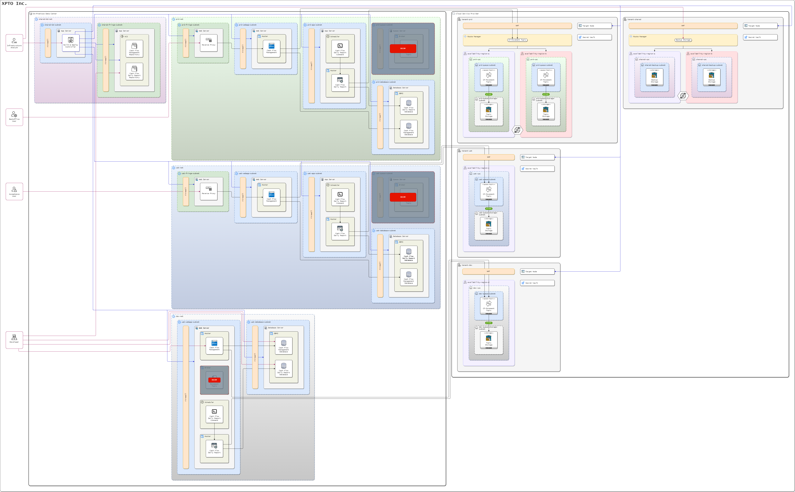
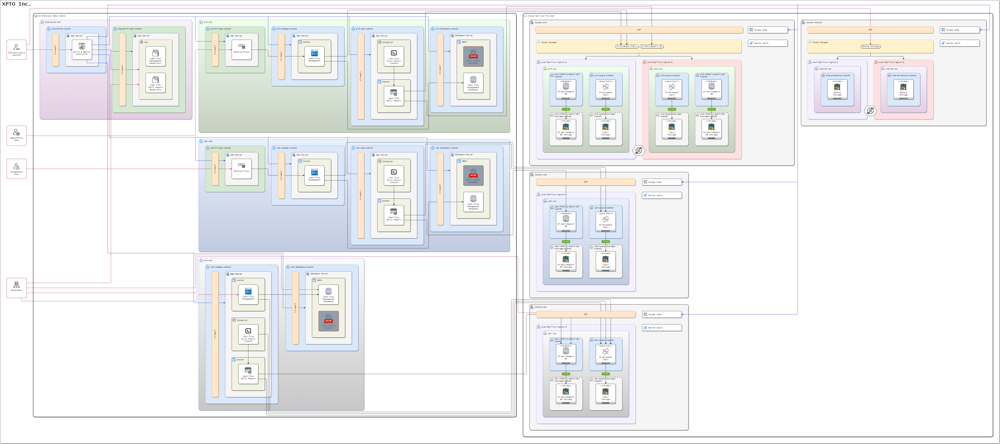

# Strangle Pattern aplicado à migração para a nuvem

## On-premisses

Minha interpretação do cenário on-premisses da XPTO:

- Versionamento de código local
- Build e deployment local com entrega via controler local (análogo ao Ansible controller node)
- Servidores especializados em produção e UAT
- Servidores compartilhados em desenvolvimento

## Backup

Mover os backups regulares para a nuvem, permitindo o descomissionamento dos backups locais e offsite, uma vez que a nuvem cobre este critério:

- Redundância dos dados
- Mais de uma região de disponibilidade sincronizadas
- Gerenciamento de tráfego para fallback automático de uma região para outra
- Deployment em nuvem com entrega via SSH (análogo ao Ansible target node)
- Conectividade com o storage protegida por link privado, restringindo acesso externo

## Mensageria

Mover a mensageria para a nuvem, considerando que mensageria costuma ser utilizada em fluxos assícronos e, portanto, mais tolerantes a aumento de latência em chamadas externas (on-premisses para nuvem):

- Multi tenant para forçar a segregação entre os ambientes, preservando as variáveis, segredos e permissões
- Evidenciada a oportunidade de escolher regiões com diferentes requisitos conforme os ambientes
  - Em produção o menor tempo de resposta é mais importante do que nos demais ambientes
  - Em desenvolvimento o menor custo de operação tende a ser mais relevante do que o menor tempo de resposta
- Considerando a não necessidade de redundância nos ambientes não produção, o gerenciamento de tráfego não foi aplicado (também por não ser uma dependência)

## Background process database

Mover o banco de dados do processo de consolidado diário para a nuvem, considerando que sendo um processo em segundo plano há maior tolerância a um aumento no tempo de resposta:

## Background process

Mover o consolidador de relatório diário, que fica boa parte do dia parado, para função serverless, economizando recurso nos períodos de ociosidade:

- Adotado um roteador de eventos para endereçar o fallback automático entre regiões de disponibilidade
  - O roteador de eventos foi preservado nos ambientes não produção pois se tornam dependências nas integrações, permitindo maior interoperabilidade entre os ambientes

## Main process

Para a movimentação do processo principal, de registro das movimentações financeiras, é necessário considerar a natureza das operações. Considerei 3 cenários principais:

- Cenário 1: Grandes picos de demanda aliados a grandes períodos de inatividade, sem down time, como bilheteria de eventos
- Cenário 2: Raros períodos de inatividade aliados a necessidade de acomodar picos de demanda sem down time, como loja virtual
- Cenário 3: Teto conhecido para os picos de demanda e em períodos bem determinados e previsíveis, com tolerância a down time agendado, como super mercado

### Cenário 1 - Bilheteria de eventos

Mover a aplicação principal para uma solução serverless ou PaaS auto escalável gerenciado, com provisionamento sob demanda e sem custo em períodos de inatividade:

### Cenário 2 - Loja virtual

Mover a aplicação principal para uma solução Kubernetes auto escalável, favorecendo uma disponibilidade mínima compatível com o volume médio de demanda e scale-up/down automáticos conforme a variação da demanda:

### Cenário 3 - Super mercado

Mover a aplicação principal para uma máquina virtual compatível com a demanda média e estratégias de vertical scaling up/down:

## VCS, build e deployment

Mover as soluções de versionamento de código, de build e de deployment:

## Cenário final em nuvem

